# Sweet Shop Management System

A full-stack TDD kata project for managing a sweet shop inventory and sales. Built with Node.js/Express backend and Next.js frontend, using MongoDB as the database.

**GitHub Repository**: [https://github.com/shreyasjha03/IncubyteProject.git](https://github.com/shreyasjha03/IncubyteProject.git)

## Features

- **User Authentication**: Register and login with JWT token-based authentication
- **Sweet Management**: CRUD operations for sweets (Admin only)
- **Inventory Management**: Purchase sweets and restock inventory (Admin only)
- **Search & Filter**: Search sweets by name, category, or price range
- **Responsive UI**: Modern, mobile-friendly interface built with Tailwind CSS


## Deployment

The project is fully deployed and accessible online:

### Live URLs

- **Frontend (Vercel)**: [https://frontend-mneicbslm-shreyasjha03s-projects.vercel.app](https://frontend-mneicbslm-shreyasjha03s-projects.vercel.app)
- **Backend API (Railway)**: [https://backend-production-c6f9.up.railway.app](https://backend-production-c6f9.up.railway.app)
- **Backend Health Check**: [https://backend-production-c6f9.up.railway.app/health](https://backend-production-c6f9.up.railway.app/health)

### Deployment Platforms

- **Frontend**: Deployed on [Vercel](https://vercel.com) - Next.js optimized hosting
- **Backend**: Deployed on [Railway](https://railway.app) - Node.js server hosting
- **Database**: [MongoDB Atlas](https://www.mongodb.com/cloud/atlas) - Cloud database service

### Access the Application

1. **Visit the Frontend**: Open [https://frontend-mneicbslm-shreyasjha03s-projects.vercel.app](https://frontend-mneicbslm-shreyasjha03s-projects.vercel.app)
2. **Register/Login**: Create an account or use existing credentials
3. **Admin Access**: Use admin credentials to access admin panel and manage sweets

### Admin Credentials

For testing admin features, use:
- **Email**: `shreyasjha16@gmail.com`
- **Password**: `Raunak@955`
- **Role**: `admin`

## Tech Stack

### Backend
- Node.js with Express
- TypeScript
- MongoDB with Mongoose
- JWT for authentication
- Express Validator for input validation

### Frontend
- Next.js 14 (App Router)
- React 18
- TypeScript
- Tailwind CSS
- Axios for API calls

## Project Structure

```
IncubyteAssignment/
├── backend/
│   ├── src/
│   │   ├── models/         # MongoDB models (User, Sweet)
│   │   ├── routes/         # API routes (auth, sweets, inventory)
│   │   ├── middleware/     # Authentication middleware
│   │   ├── __tests__/      # Test files
│   │   └── server.ts       # Express server setup
│   ├── package.json
│   └── tsconfig.json
├── frontend/
│   ├── app/                # Next.js app directory
│   │   ├── login/          # Login page
│   │   ├── register/       # Registration page
│   │   └── dashboard/      # Main dashboard
│   ├── components/         # React components
│   ├── utils/              # Utility functions (auth, API)
│   └── package.json
└── README.md
```

## Setup Instructions

### Prerequisites
- Node.js (v18 or higher)
- MongoDB (local installation or MongoDB Atlas)
- npm or yarn

### Backend Setup

1. Navigate to the backend directory:
```bash
cd backend
```

2. Install dependencies:
```bash
npm install
```

3. Create a `.env` file in the backend directory:
```env
PORT=5000
MONGODB_URI=mongodb://localhost:27017/sweet-shop
JWT_SECRET=your-secret-key-change-in-production
NODE_ENV=development
```

4. Start the development server:
```bash
npm run dev
```

The backend API will be running on `http://localhost:5000`

### Frontend Setup

1. Navigate to the frontend directory:
```bash
cd frontend
```

2. Install dependencies:
```bash
npm install
```

3. Create a `.env.local` file in the frontend directory:
```env
NEXT_PUBLIC_API_URL=http://localhost:5000/api
```

4. Start the development server:
```bash
npm run dev
```

The frontend will be running on `http://localhost:3000`

## Screenshots

### Application Screenshots

#### 1. Login Page
Beautiful gradient background with form validation and password visibility toggle.

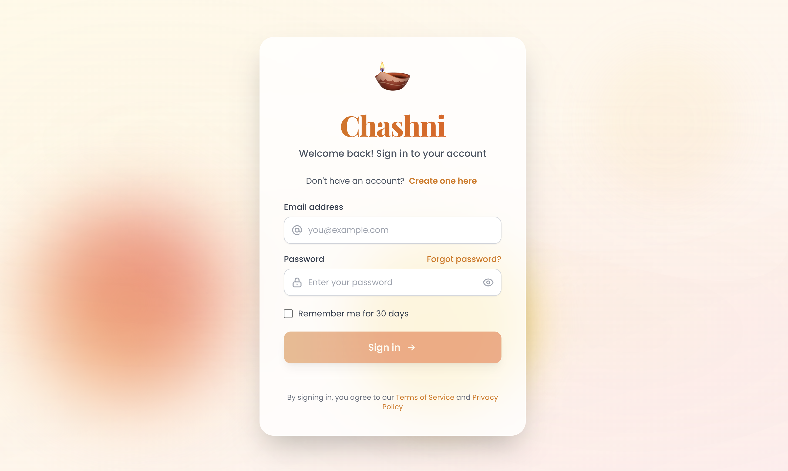

#### 2. Dashboard
Responsive grid layout showing all sweets with search and filter functionality.

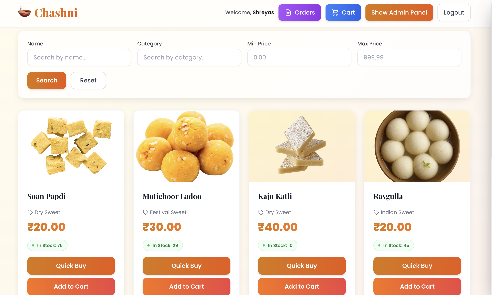

#### 3. Shopping Cart
Sliding panel with cart items, quantity controls, and checkout button.

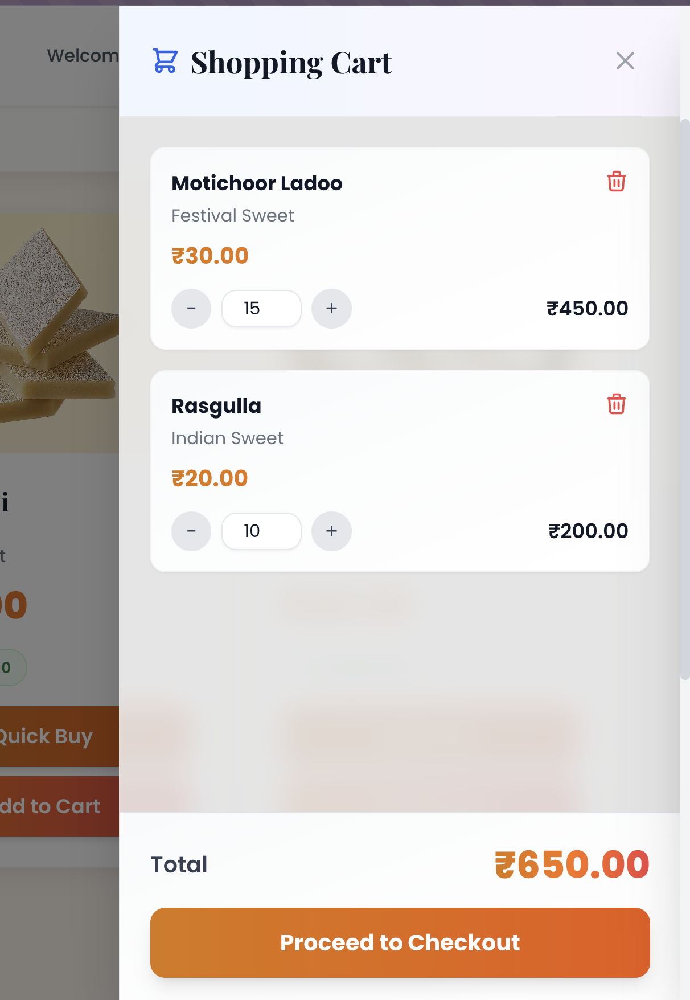

#### 4. Admin Panel
Sweet management interface with image upload (computer or URL).

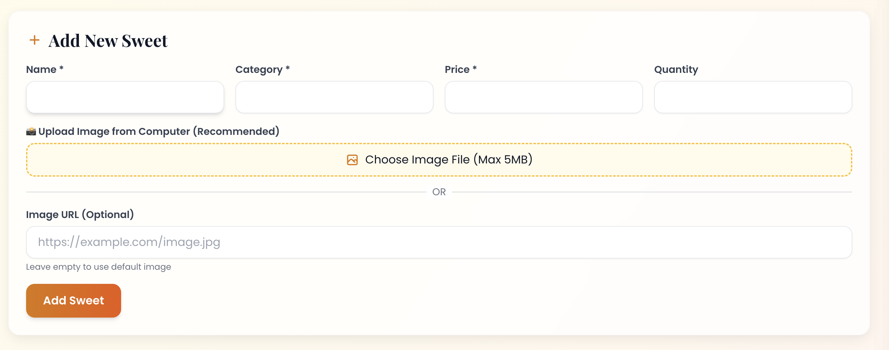

#### 5. Admin Actions
Admin functionality showcasing Edit, Restock, and Delete operations for sweets management.

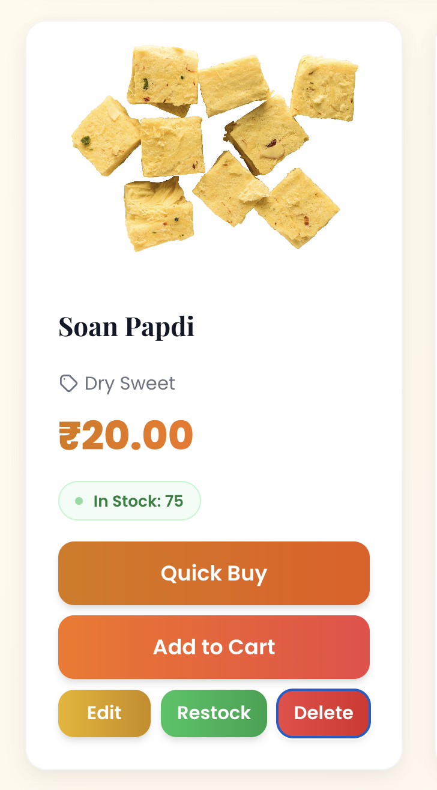

#### 6. Order History
Past orders displayed in sliding panel with order details.

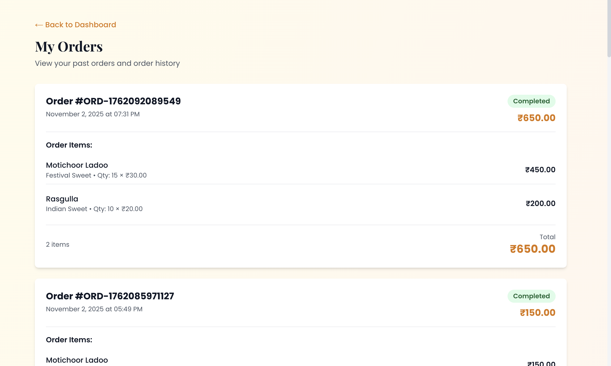

#### 7. Order Panel
Side panel showing order history with all past orders.

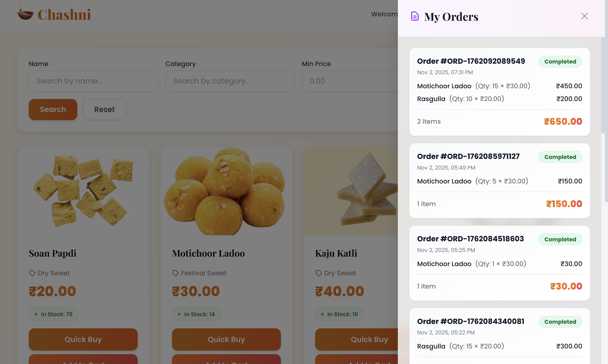

#### 8. Checkout Page
Order review page with customer information and order summary.

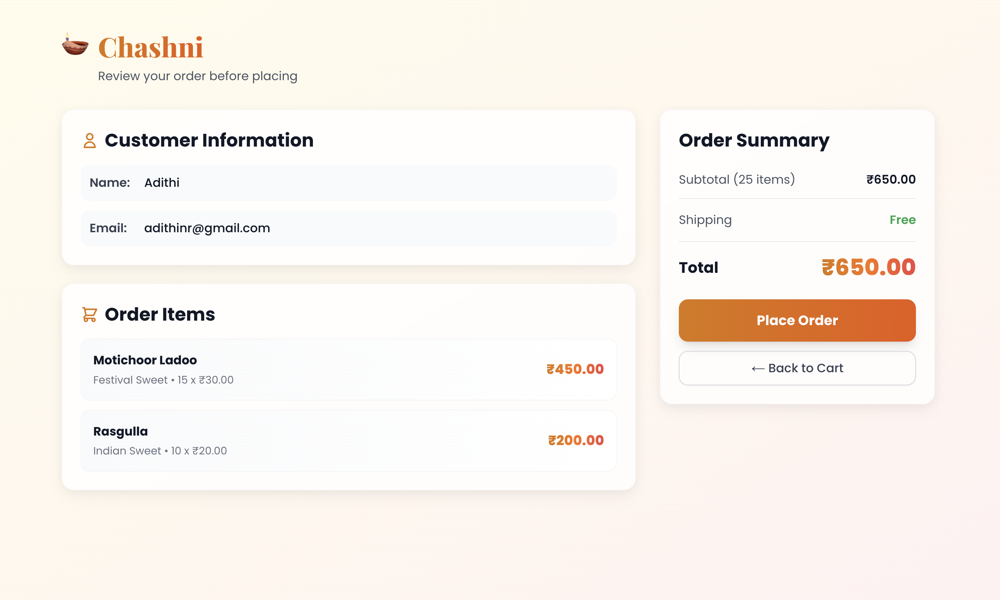

#### 9. Order Process Flow
Complete order flow showing the purchase process.

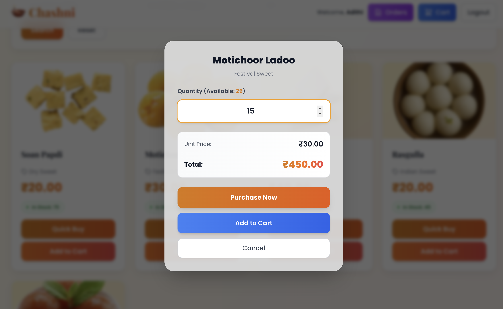

#### 10. Order Placed
Confirmation screen showing successful order placement.

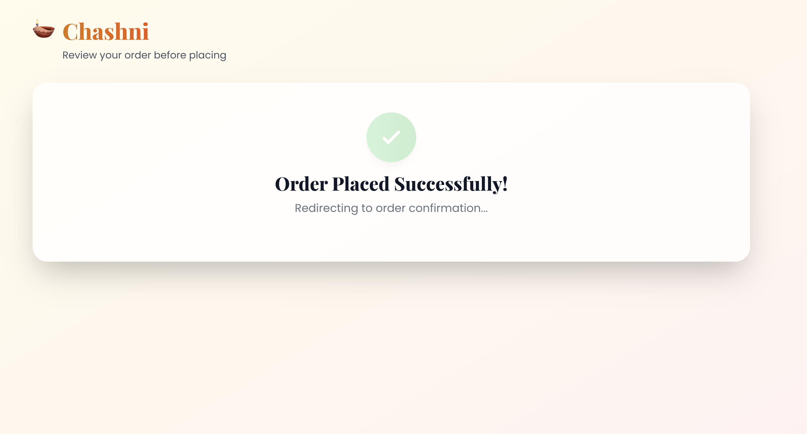

#### 11. Order Confirmation
Final order confirmation page with order details.

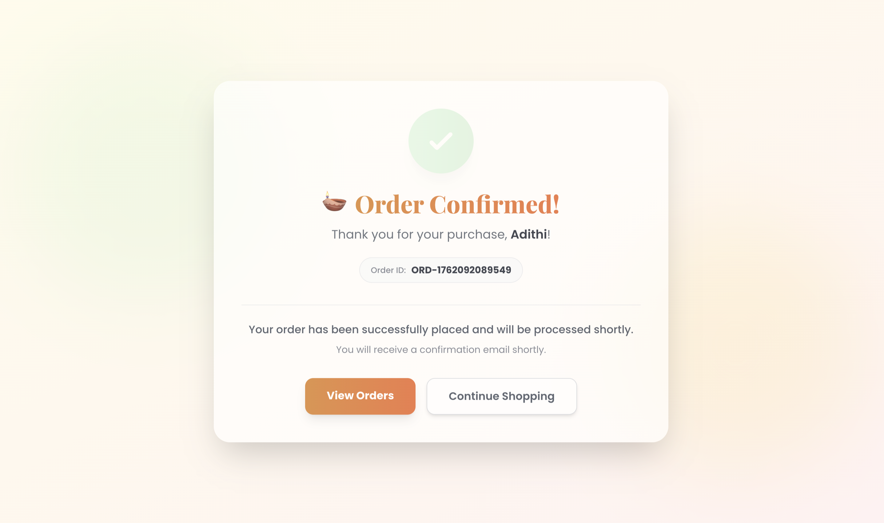

## Test Report

See `TEST_REPORT.md` for detailed test results and coverage information.

### Test Summary

- **Test Suites**: 3 (auth, sweets, inventory)
- **Total Tests**: 18
- **Test Coverage**: 
  - Statements: 50.64%
  - Branches: 24.69%
  - Functions: 39.28%
  - Lines: 50.82%

### Running Tests

```bash
cd backend
npm test
```

For coverage report:
```bash
cd backend
npm test -- --coverage
```

## API Endpoints

### Authentication
- `POST /api/auth/register` - Register a new user
- `POST /api/auth/login` - Login user

### Sweets (Protected)
- `GET /api/sweets` - Get all sweets
- `GET /api/sweets/:id` - Get a single sweet
- `GET /api/sweets/search` - Search sweets (query params: name, category, minPrice, maxPrice)
- `POST /api/sweets` - Add a new sweet (Admin only)
- `PUT /api/sweets/:id` - Update a sweet (Admin only)
- `DELETE /api/sweets/:id` - Delete a sweet (Admin only)

### Inventory (Protected)
- `POST /api/sweets/:id/purchase` - Purchase a sweet (decreases quantity)
- `POST /api/sweets/:id/restock` - Restock a sweet (Admin only, increases quantity)

### Authentication Header
All protected endpoints require the JWT token in the Authorization header:
```
Authorization: Bearer <token>
```

## API Testing & Database Access

### 📊 Accessing the Database

#### Using MongoDB Shell (`mongosh`)

```bash
# Connect to your database
mongosh sweet-shop

# Or with full connection string
mongosh "mongodb://localhost:27017/sweet-shop"
```

**Useful MongoDB Commands:**

```javascript
// List all collections
show collections

// View all users
db.users.find().pretty()

// View all sweets
db.sweets.find().pretty()

// Count documents
db.users.countDocuments()
db.sweets.countDocuments()

// Make a user admin
db.users.updateOne(
  { email: "user@example.com" },
  { $set: { role: "admin" } }
)

// Verify admin role
db.users.findOne({ email: "user@example.com" })

// Add a test sweet directly to database
db.sweets.insertOne({
  name: "Chocolate Bar",
  category: "Chocolate",
  price: 5.99,
  quantity: 10
})

// Delete all sweets (cleanup)
db.sweets.deleteMany({})
```

#### Using MongoDB Compass (GUI)

1. Download from: https://www.mongodb.com/products/compass
2. Connect using: `mongodb://localhost:27017/sweet-shop`
3. Browse collections visually

### 🔐 Getting Authentication Token

First, you need to login and get your JWT token.

#### Option A: Via Browser (Easiest)
1. Open `http://localhost:3000/login`
2. Login with your credentials
3. Open Browser DevTools (F12)
4. Go to: Application → Cookies → `http://localhost:3000`
5. Copy the `token` value

#### Option B: Via API
```bash
# Login via API to get token
curl -X POST http://localhost:5001/api/auth/login \
  -H "Content-Type: application/json" \
  -d '{"email": "user@example.com", "password": "YOUR_PASSWORD"}'

# Response will contain the token
# Save it as TOKEN variable:
export TOKEN="your-jwt-token-here"
```

### ✅ Testing API Endpoints

#### Authentication Endpoints

**1. POST /api/auth/register**
```bash
curl -X POST http://localhost:5001/api/auth/register \
  -H "Content-Type: application/json" \
  -d '{
    "username": "testuser",
    "email": "test@example.com",
    "password": "password123"
  }'
```

**2. POST /api/auth/login**
```bash
curl -X POST http://localhost:5001/api/auth/login \
  -H "Content-Type: application/json" \
  -d '{
    "email": "user@example.com",
    "password": "YOUR_PASSWORD"
  }'
```

#### Sweets Endpoints (Protected - Need Token)

**3. GET /api/sweets - List all sweets**
```bash
curl -X GET http://localhost:5001/api/sweets \
  -H "Authorization: Bearer $TOKEN"
```

**4. GET /api/sweets/search - Search sweets**
```bash
# Search by name
curl -X GET "http://localhost:5001/api/sweets/search?name=chocolate" \
  -H "Authorization: Bearer $TOKEN"

# Search by category
curl -X GET "http://localhost:5001/api/sweets/search?category=Candy" \
  -H "Authorization: Bearer $TOKEN"

# Search by price range
curl -X GET "http://localhost:5001/api/sweets/search?minPrice=3&maxPrice=10" \
  -H "Authorization: Bearer $TOKEN"

# Combined search
curl -X GET "http://localhost:5001/api/sweets/search?name=chocolate&category=Candy&minPrice=1&maxPrice=20" \
  -H "Authorization: Bearer $TOKEN"
```

**5. GET /api/sweets/:id - Get single sweet**
```bash
# First, get a sweet ID from listing all sweets
curl -X GET http://localhost:5001/api/sweets \
  -H "Authorization: Bearer $TOKEN"

# Then use the _id to get details
curl -X GET "http://localhost:5001/api/sweets/SWEET_ID_HERE" \
  -H "Authorization: Bearer $TOKEN"
```

**6. POST /api/sweets - Add new sweet (Admin only)**
```bash
curl -X POST http://localhost:5001/api/sweets \
  -H "Content-Type: application/json" \
  -H "Authorization: Bearer $TOKEN" \
  -d '{
    "name": "Gummy Bears",
    "category": "Candy",
    "price": 3.99,
    "quantity": 50
  }'
```

**7. PUT /api/sweets/:id - Update sweet (Admin only)**
```bash
curl -X PUT "http://localhost:5001/api/sweets/SWEET_ID_HERE" \
  -H "Content-Type: application/json" \
  -H "Authorization: Bearer $TOKEN" \
  -d '{
    "price": 4.99,
    "quantity": 75
  }'
```

**8. DELETE /api/sweets/:id - Delete sweet (Admin only)**
```bash
curl -X DELETE "http://localhost:5001/api/sweets/SWEET_ID_HERE" \
  -H "Authorization: Bearer $TOKEN"
```

#### Inventory Endpoints (Protected)

**9. POST /api/sweets/:id/purchase - Purchase a sweet**
```bash
# Purchase 1 unit (default)
curl -X POST "http://localhost:5001/api/sweets/SWEET_ID_HERE/purchase" \
  -H "Content-Type: application/json" \
  -H "Authorization: Bearer $TOKEN" \
  -d '{"quantity": 1}'

# Purchase multiple units
curl -X POST "http://localhost:5001/api/sweets/SWEET_ID_HERE/purchase" \
  -H "Content-Type: application/json" \
  -H "Authorization: Bearer $TOKEN" \
  -d '{"quantity": 5}'
```

**10. POST /api/sweets/:id/restock - Restock sweet (Admin only)**
```bash
curl -X POST "http://localhost:5001/api/sweets/SWEET_ID_HERE/restock" \
  -H "Content-Type: application/json" \
  -H "Authorization: Bearer $TOKEN" \
  -d '{"quantity": 100}'
```

### 🔧 Make User Admin (Required for Admin Endpoints)

Run this in MongoDB shell:
```javascript
db.users.updateOne(
  { email: "user@example.com" },
  { $set: { role: "admin" } }
)
```

Or via command line:
```bash
mongosh sweet-shop --eval 'db.users.updateOne({email: "user@example.com"}, {$set: {role: "admin"}})'
```

After this, logout and login again from the frontend to refresh your token!

## Running Tests

### Backend Tests
```bash
cd backend
npm test
```

### Test-Driven Development (TDD)

This project follows the **Red-Green-Refactor** TDD cycle:

1. **🔴 RED**: Write failing tests first
2. **🟢 GREEN**: Implement minimal code to pass tests
3. **🔵 REFACTOR**: Improve code quality while keeping tests passing

See `TDD_GUIDE.md` for detailed TDD workflow and best practices.

### Test Coverage
- Authentication endpoints: Tested ✅
- Sweet management: Tested ✅
- Inventory operations: Tested ✅

### Test Report
See `TEST_REPORT.md` for comprehensive test results and coverage details.

Run tests with coverage:
```bash
cd backend
npm test -- --coverage
```

## Git Workflow & Version Control

This project follows Git best practices with clear commit messages and AI co-author attribution.

### Commit Message Format

All commits follow this format:
```
<type>: <description>

<detailed explanation if needed>

Co-authored-by: Cursor AI <auto@cursor.com>
```

### Commit Types
- `test:` - Adding or modifying tests (RED phase)
- `feat:` - New feature implementation (GREEN phase)
- `refactor:` - Code improvements (REFACTOR phase)
- `fix:` - Bug fixes
- `docs:` - Documentation changes
- `chore:` - Build/config changes

### AI Co-Author Attribution

Every commit using AI assistance includes:
```
Co-authored-by: Cursor AI <auto@cursor.com>
```

This ensures transparency about AI tool usage in the development process.

See `TDD_GUIDE.md` for detailed instructions on viewing the Red-Green-Refactor pattern in the commit history.

## Default Admin User

To create an admin user, you can either:
1. Manually set the `role` field to `'admin'` in MongoDB
2. Or register a user and update it in the database:
```javascript
db.users.updateOne({ email: "admin@example.com" }, { $set: { role: "admin" } })
```

3. **Or use the provided script** (for local development):
```bash
cd backend
npm run create-admin
```

This script will create an admin user with:
- **Username**: Shreyas
- **Email**: shreyasjha16@gmail.com
- **Password**: Raunak@955
- **Role**: admin

## Usage

1. **Register/Login**: Create an account or login with existing credentials
2. **Browse Sweets**: View all available sweets on the dashboard
3. **Search**: Use the search bar to filter sweets by name, category, or price
4. **Purchase**: Click the "Purchase" button on any sweet (disabled if out of stock)
5. **Admin Functions** (Admin users only):
   - Click "Show Admin Panel" to add new sweets
   - Use Edit/Restock/Delete buttons on sweet cards to manage inventory

## Development

### Backend
- `npm run dev` - Start development server with hot reload
- `npm run build` - Build for production
- `npm start` - Start production server
- `npm run create-admin` - Create admin user script
- `npm run seed` - Seed database with sample sweets
- `npm run clear` - Clear all sweets from database
- `npm test` - Run tests
- `npm test -- --coverage` - Run tests with coverage report

### Frontend
- `npm run dev` - Start development server
- `npm run build` - Build for production
- `npm start` - Start production server

## My AI Usage

This project was developed with the assistance of AI tools to enhance productivity, code quality, and problem-solving capabilities.

### AI Tools Used

- **Cursor AI (Auto)** - Primary AI coding assistant integrated into the development environment
- **AI-assisted code generation and debugging** - Used throughout the development lifecycle

### How AI Was Used

#### 1. **Project Structure and Architecture Design**
   - Used AI to brainstorm and design the initial project structure
   - Collaborated on RESTful API endpoint design and naming conventions
   - Discussed database schema design (User model, Sweet model, Order model)

#### 2. **Backend Development**
   - **API Routes**: AI helped generate Express route handlers for authentication, sweets management, inventory operations, and order processing
   - **Authentication Middleware**: Collaborated on implementing JWT-based authentication and admin role verification
   - **Input Validation**: Used AI to set up express-validator rules for all endpoints
   - **Error Handling**: AI assisted in creating consistent error response patterns
   - **File Upload**: Implemented Multer for image uploads with AI guidance on configuration and security

#### 3. **Frontend Development**
   - **Component Architecture**: AI helped design React component structure (AdminPanel, SweetCard, CartPanel, OrdersPanel)
   - **State Management**: Collaborated on implementing shopping cart functionality using local storage and cookies
   - **UI/UX Enhancements**: 
     - Used AI to create responsive, modern login/register pages with proper form validation
     - Implemented password visibility toggles and real-time validation feedback
     - Designed sliding panel components for cart and orders
   - **Styling**: AI assisted with Tailwind CSS configurations, custom color palettes, and responsive design patterns
   - **Client-side Routing**: Implemented Next.js navigation and route protection with AI guidance

#### 4. **Feature Implementation**
   - **Shopping Cart System**: AI helped design and implement the complete cart functionality with add/remove/update operations
   - **Order Management**: Collaborated on creating order history with backend API integration
   - **Search Functionality**: Implemented search and filter features with AI assistance
   - **Image Upload**: Developed file upload feature with preview and validation
   - **Password Reset Flow**: Created complete forgot password functionality with token generation and validation

#### 5. **Bug Fixes and Problem Solving**
   - **EADDRINUSE Error**: AI helped diagnose and fix port conflict issues
   - **Token Authentication**: Fixed token retrieval from cookies vs localStorage mismatch
   - **Form Validation**: Resolved validation errors for imageUrl with localhost URLs
   - **TypeScript Errors**: AI assisted in resolving type mismatches and interface definitions
   - **CSS Issues**: Fixed input text visibility and styling inconsistencies

#### 6. **Code Quality and Best Practices**
   - **Error Handling**: AI suggested improvements for comprehensive error handling patterns
   - **Security**: Implemented password hashing, JWT tokens, and input sanitization with AI guidance
   - **Code Organization**: Maintained clean code structure with AI-assisted refactoring
   - **Accessibility**: Added ARIA labels and keyboard navigation with AI suggestions

#### 7. **UI/UX Design**
   - **Theme Development**: Collaborated on creating "Chashni" brand identity with Indian mithai shop theme
   - **Visual Design**: AI helped design elegant backgrounds, gradient effects, and decorative elements
   - **Responsive Design**: Ensured mobile-friendly layouts with AI assistance
   - **Animation**: Implemented smooth transitions and animations for better user experience

#### 8. **Documentation and Testing**
   - **Code Comments**: AI helped generate clear, meaningful comments
   - **API Documentation**: Assisted in documenting endpoint structures and request/response formats

### Reflection on AI Impact

#### Positive Impacts

1. **Accelerated Development**: AI significantly sped up the development process by:
   - Generating boilerplate code for routes, models, and components
   - Providing instant solutions to common problems (authentication patterns, form handling)
   - Suggesting best practices without extensive research time

2. **Enhanced Code Quality**:
   - AI suggestions helped maintain consistent coding patterns across the project
   - Caught potential security issues early (token handling, input validation)
   - Improved error handling and user feedback mechanisms

3. **Learning and Problem Solving**:
   - AI served as an interactive learning tool, explaining concepts while coding
   - Provided alternative approaches and solutions when stuck
   - Helped understand complex integration patterns (file uploads, authentication flows)

4. **Design and UX**:
   - AI assisted in creating professional, modern UI designs
   - Suggested accessibility improvements and responsive design patterns
   - Helped implement smooth animations and transitions

5. **Debugging Efficiency**:
   - Rapid diagnosis of errors (token issues, port conflicts, validation problems)
   - Suggested fixes with explanations, improving understanding
   - Reduced time spent on troubleshooting

#### Challenges and Learnings

1. **Verification Required**: Not all AI suggestions were perfect; I learned to:
   - Verify AI-generated code before implementation
   - Understand the code rather than blindly accepting suggestions
   - Test thoroughly even with AI assistance

2. **Context Awareness**: 
   - Sometimes needed multiple iterations to get the right solution
   - Had to provide clear context about project requirements and constraints
   - Learned to ask more specific questions for better results

3. **Balance Between AI and Understanding**:
   - Used AI as a tool to enhance productivity, not replace learning
   - Ensured I understood the code before implementing it
   - Maintained ownership and understanding of the entire codebase

#### Overall Assessment

AI tools were instrumental in completing this project efficiently while maintaining high code quality. The collaborative approach between human judgment and AI assistance resulted in:
- Faster feature implementation
- Better code organization and consistency
- Enhanced user experience with modern UI/UX
- Comprehensive error handling and security measures
- Professional documentation and project structure

The AI acted as a powerful pair-programming partner, helping navigate complex integrations, suggesting best practices, and accelerating development without compromising code quality or understanding.

## License

ISC

